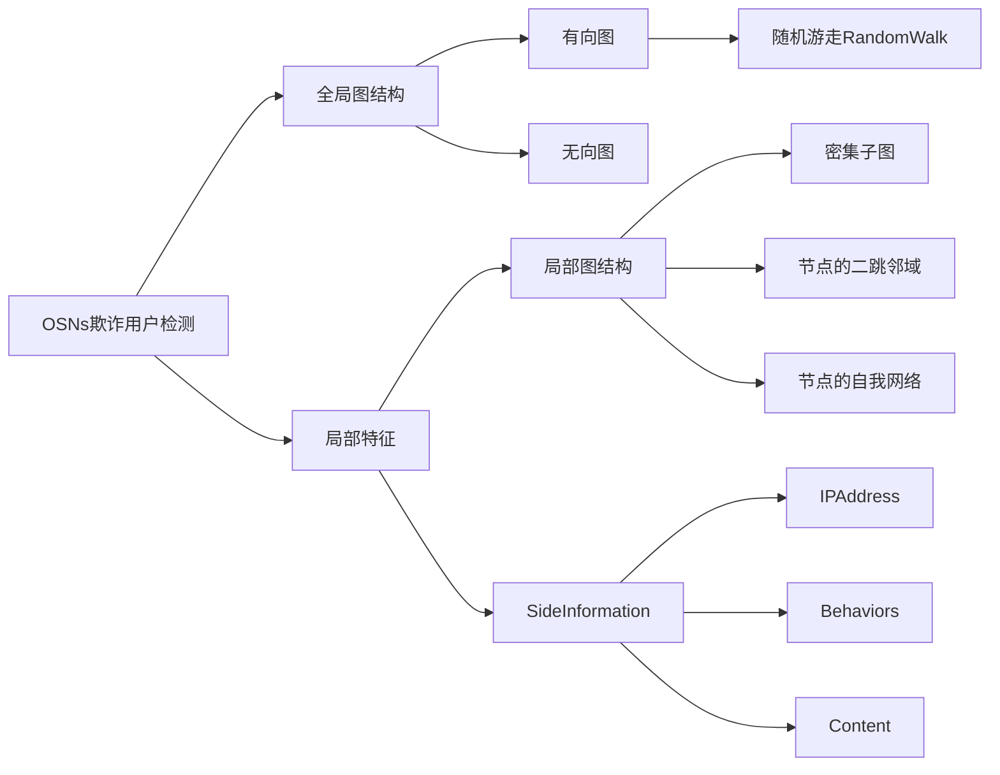
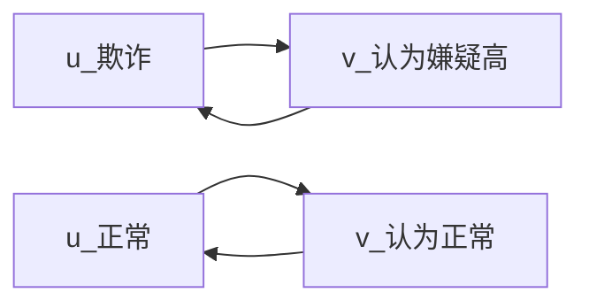
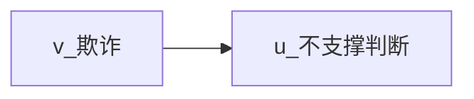
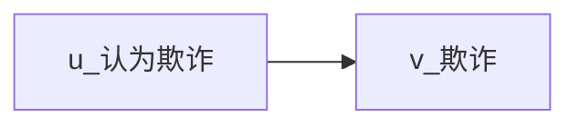

* * *> 人人看得懂的顶会论文系列之：GANG
> ICDM(IEEE International Conference on Data Mining) 2017，引用98
> 论文标题：GANG: Detecting Fraudulent Users in Online Social Networks via Guilt-by-Association on Directed Graphs

- Binghui Wang, Neil Zhenqiang Gong, Hao Fu

# 前言
作者是微软亚洲研究院的**Hao Fu**以及爱荷华州立大学（Iowa State University QS 400）的**Binghui Wang, Neil Zhenqiang Gong**。

# 一、适用场景
Twitter、Facebook、Ins、LinkedIn、微博、微信、贴吧，这些媒体被称为**在线社交网络OSNs**（Online Social Networks）。
GANG针对**有向图**，采用欺诈扩散方法（Guilt-by-Association），检测OSNs中的欺诈用户。

~~恶意账户检测(Malicious Account Detection)、风险账户检测(Risk Account Detection)、虚假账户检测(Fake Account Detection)、女巫攻击（Sybil Attacks 简单理解就是批量注册大量账号，伪造身份攻击）、Sybil Detection等，通常是指介绍网络的虚假用户检测。~~

# 二、算法效果
- 数据集大小：实验在包含4165万用户和14.68亿条边的**Twitter数据集**，以及包含353万用户和6.53亿条边的 **新浪微博数据集上** 进行。
- 指标提升：GANG在Twitter数据集上的AUC为0.72，在Sina Weibo数据集上的AUC为0.80，显著优于现有方法。

# 三、论文创新的点
成对马尔可夫随机场建模用户标签的联合概率分布。

算法基于一种新颖的成对马尔可夫随机场（a novel pairwise Markov
Random Field），并对环状信念传播(Loopy Belief Propagation)进行了优化。

# 四、算法的优化目标
1.直观感受
**图定义**：
定义有向图G=（V，E），其中V表示节点，E表示边。节点$u \in V$、$v \in V$代表具体用户。
定义$x_u=1$ 代表节点u涉嫌欺诈，$x_u=-1$代表节点u不涉嫌欺诈。
**扩散逻辑**：
1.1 如果边(u,v)和边(v,u)都存在，则认为u和v具有一样的性质。
说人话：**互相关注，一丘之貉**。

1.2 如果仅边(v,u)存在，且v属于欺诈，不支持做判断。
说人话：放心，不会因为坏人关注你，

1.3 如果仅边(u,v)存在，且v属于欺诈，则u倾向于认为也是欺诈。

算法采用pMRF(pairwise Markov Random Field)来捕捉以上直觉。

# 五、算法迭代过程

# 六、算法在风控场景的应用

# 附件
- [\[Paper\]](https://home.engineering.iastate.edu/~neilgong/papers/GANG.pdf)
- [\[Code\]](https://github.com/safe-graph/UGFraud)

