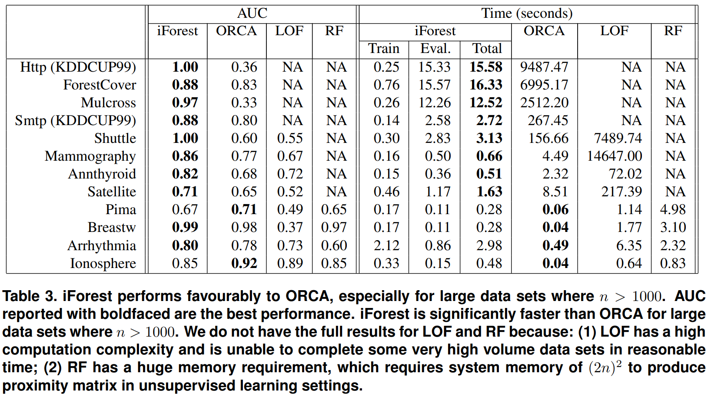
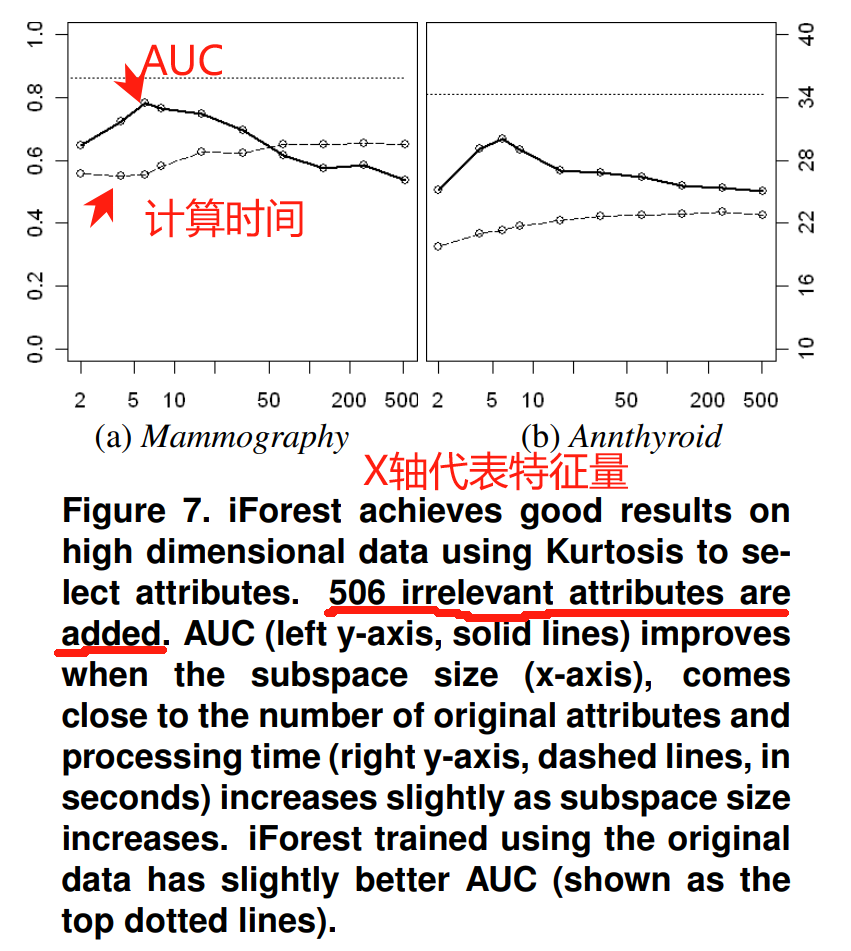
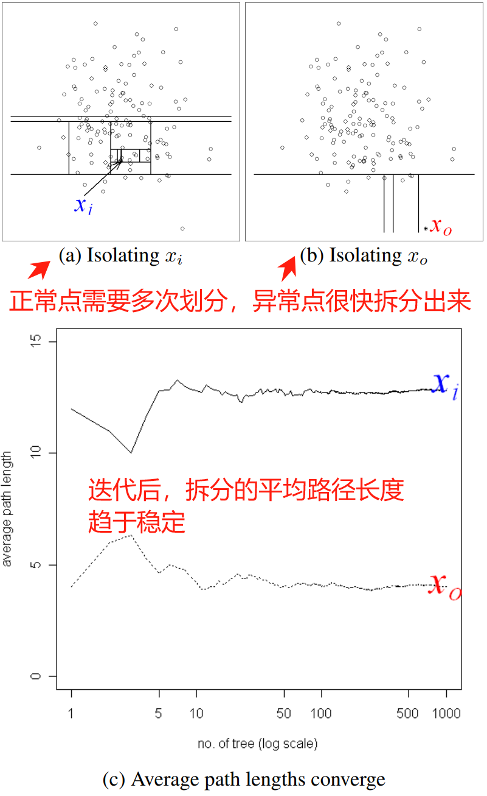
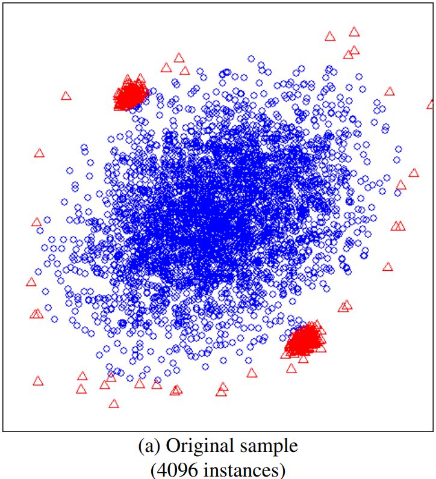
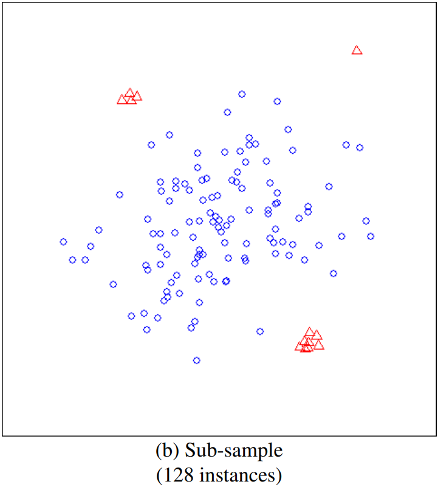
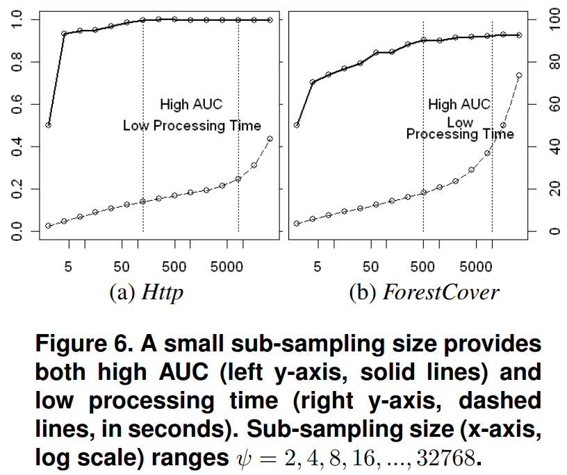

> 人人看得懂的顶会论文系列之：iForest
> (ICDM:IEEE International Conference on Data Mining) 2008 Best Paper，引用5940
> 论文标题：Isolation Forest

# 前言
作者是澳大利亚莫纳什大学(Monash University)的刘飞博士(Fei Tony Liu)和陈开明教授(Kai Ming Ting) 以及 南京大学（Nanjing University）的周志华老师(Zhi-Hua Zhou)。周志华老师大家就很熟悉了，行业大牛、西瓜书的作者，论文必属精品。
事实上，这篇论文也是ICDM 2008的Best Paper，含金量很高，工业界使用也非常多。


## 基本概念
**proper binary tree**:每个节点都恰好有**两个子节点**或者**没有任何子节点**的二叉树。和满二叉树(full binary tree)是一个东西。计算机基础课程**数据结构**里面有详细的介绍。这种树的性质是 如果叶子节点数是**n**，那么内部节点的数是**n-1**，整棵树的节点树是n+(n-1) = **2n-1**

**二叉搜索树（Binary Search Tree，简称BST）**:左子树上的所有节点的键（key）或值都小于该节点的键，而其右子树上的所有节点的键都大于或等于该节点的键。理想情况下（即树完全平衡），搜索、插入和删除这些操作的时间复杂度为**O(log n)**，其中n是树中节点的数量。AVL树、红黑树等都是二叉搜索树的变种，通过在树的节点上增加额外的信息或重新组织节点来保持树的平衡。

# 一、适用场景
异常检测场景，比如**信用卡交易欺诈检测**、天文图像中的**新星发现**、计算机网络流量中的**未授权访问**、**医学中的疾病发现**、**噪声过滤**等。

iForest的使用条件：anomalies are 'few and different'，即
1. 异常检测目标**占比少数**。
营销薅羊毛等部分风险场景，恶意比例波动较大，最高可能达到90%以上，显然不适合使用iForest。
2. 数据分布上，异常值**与众不同**。


# 二、算法效果
对比ORCA(基于K-NN的最先进的异常检测算法)、LOF(Local Outlier Factor局部异常因子)和RF(Random Forests, 随机森林)，iForest的AUC指标更优。


# 三、论文创新的点
**善于处理高维数据**：在包含较多**不相关属性**的时候，依然表现良好。从下图中可以看到，极端的添加无关特征，AUC下降并不明显，计算时间增加缓慢。原因主要是：   
1. **随机选择特征和分隔**：如果选择到不相关特征，正常和异常深度相似，如果选择到相关属性，异常点深度较浅。
2. **子采样**：增加了泛化能力，避免了不相关特征偶然拟合部分数据。


**线性时间复杂度**：善于处理大规模数据集，通过选择**子样本**和**剪枝**，将计算时间优化至接近**线性**。
训练阶段的时间复杂度为O(tψ log ψ)，在评估阶段的时间复杂度为O(nt log ψ)，其中t是树的数量，ψ是子采样大小，n是测试数据实例的数量。
以Http数据集为例，单线程Linux环境2.3GHz硬件，当ψ=256，t=100，评估283,748个实例时，总处理时间仅为7.6秒。

**低内存需求**：算法构建iTree的时候，会先对样本进行采样，而且很低的采样比例算法就能收敛，所以非常大的节省了内存。


# 四、算法迭代过程
算法有两个核心的概念，隔离树(iTree)和iForest，多棵iTree构成iForest。
随机划分数据点生成隔离树(iTree)，由于异常点更容易被隔离，因此距离根部较近，深度较浅。正常点则在树的更深层被隔离。




## 训练阶段：构建iTrees

**淹没(swamping)**：当正常实例与异常点过于接近时，为了分离异常点所需的划分数量会增加，这使得从正常实例中区分异常点变得更加困难。
**掩盖(masking)**：指的是异常点太多，掩盖了它们自己的存在。当异常点的聚类大且密集时，也会增加隔离每个异常点所需的划分数量。
采样有助于解决以上问题，直观的例子如下：



```python
# Inputs:X - input data
# t - number of trees，推荐100
# ψ - subsampling size，推荐256
# Output: a set of t iTrees
# Function1: iForest(X, t, ψ),计算复杂度：O(tψlog ψ)
Initialize Forest
# 计算树的高度限制阈值。原因是我们只关心异常点，而异常点的深度一般都很浅。
set height limit l = ceiling(log2 ψ) 
# 对每棵数进行建模
for i = 1 to t do
	# 采样建模。原因有助于解决前面提到的淹没(swamping)和掩盖(masking)问题。
	X_sub ← sample(X, ψ)
	# 随机选择特征和阈值构建iTree,然后加入Forest中。
	Forest ← Forest ∪ iTree(X_sub, 0, l)
end for
return Forest
```
关于subsampling size:ψ的选择，论文中做了实验，证明了算法随ψ收敛的非常快，所以太大的ψ是没有必要的。如下图：


```python
# Inputs:X - input data
# e - current tree height
# l - heightlimit
# Output: an iTree
# Function 2:iTree(X, e, l)
#停止条件1:树的高度达到预先设置的最大高度
#停止条件2：节点只剩一行数据,无法进一步拆分。

if e ≥ l or |X| ≤ 1 then
	return exNode{Size ← |X|}
else
	let Q be a list of attributes in X
	randomly select an attribute q ∈ Q
	randomly select a split point p from max and min values of attribute q in X
	Xl ← filter(X, q < p)
	Xr ← filter(X, q ≥ p)
	return inNode{Lef t ← iTree(Xl, e + 1, l),
				  Right ← iTree(Xr, e + 1, l),
				  SplitAtt ← q,
				  SplitValue ← p}
end if
```


## 异常评分：根据节点的平均深度来计算异常分数。
异常评分涉及到非常细节的部分，可以直接看**速读结论**，不影响算法的落地使用。

**路径长度**（Path Length）：对于一个数据点x，其路径长度h(x)是在iTree中从根节点到外部节点所经过的边的数目。
**异常分数**（Anomaly Score）：异常分数是一个用于量化数据点异常程度的数值。异常分数是通过路径长度计算得出的，基本原理是路径长度越短，异常分数越高，数据点越可能是异常点。
**归一化问题**：路径长度是1到无穷的数据范围，需要映射到比如0-1这样有固定范围的分数区间。作者提到不管是用**最大值归一化**还是使用**平均高度归一化**，都会导致范围不确定或者无法直接比较的问题。
个人解读：
如果采用**最大值归一化**，路径长度和n正相关，那么会导致同一个数据分布不同数据量直接无法比较。对于大数据量的情况，最大值可能非常极端，导致所有数据的异常值集中在0附近，无法真正检测到异常。
**平均高度归一化**，路径长度和log(n)正相关，会导致范围不确定。
**新的归一化方法**，为解决以上问题，作者参考论文《Data Structures and Algorithms with ObjectOriented Design Patterns in Java》中10.3.3节的结论，迁移Binary Search Tree (BST)不成功搜索时的平均路径长度$c(n)$，来计算iTree中的平均iTree深度，作为归一化的分母。 
$c(n)=2 H(n-1)-(2(n-1) / n)$
其中，$H(i)=\frac{1}{1}+\frac{1}{2}+\frac{1}{3}+\frac{1}{4}+\ldots+\frac{1}{i}$ , $H(i)≈ln(i)+γ$，$γ≈0.5772156649$是欧拉常数。

最终的映射算法：
$s(x,n)=2^{-\frac{E(h(x))}{c(n)}}$

**速读结论如下**：
$E(h(x)) → 0, s→1$，则几乎可以确定是异常点。
$E(h(x))→c(n)，s→0.5$：则整个样本实际上没有明显的异常。
$E(h(x)) → n − 1，s → 0$：则它们很安全地可以被视为正常实例。


# 五、算法在风控场景的应用
在金融欺诈、广告作弊媒体识别等场景，都满足目标群体占比小且异常的特点。
算法对冗余特征的鲁棒性，树形算法对特征的高包容，基本可以无脑添加特征，对新手也比较友好。
另外，周志华老师出品的Best Paper，5K+的引用量，不用怀疑捡到宝了~

# 附件
- [\[Paper\] IsolationForest](https://cs.nju.edu.cn/zhouzh/zhouzh.files/publication/icdm08b.pdf '(ICDM:IEEE International Conference on Data Mining) 2008 Best Paper，引用5940')

- [\[Paper\] Isolation-based anomaly detection](https://cs.nju.edu.cn/zhouzh/zhouzh.files/publication/tkdd11.pdf '(TKDD:ACM Transactions on Knowledge Discovery from Data) 2012，引用1905')
