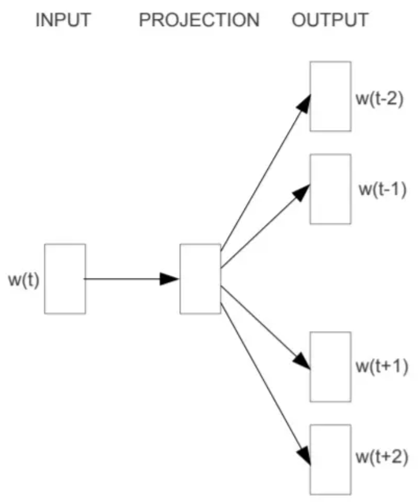
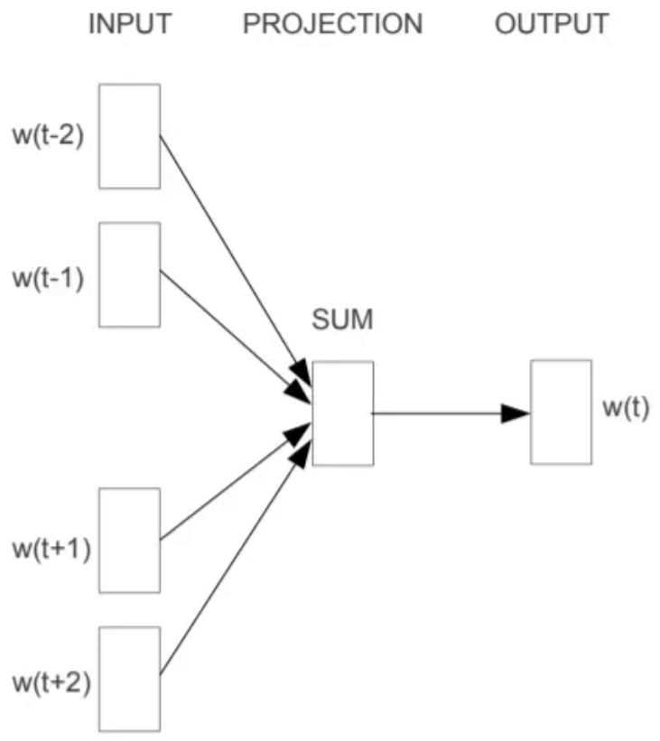
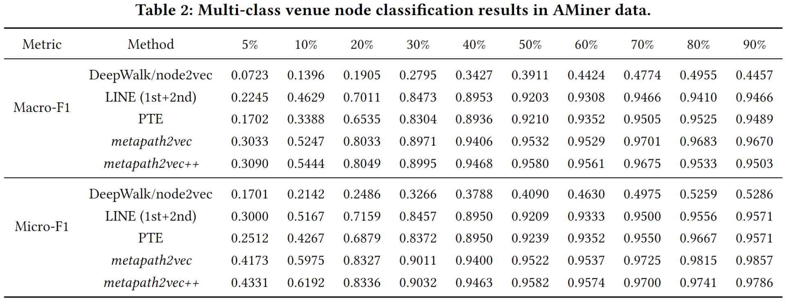
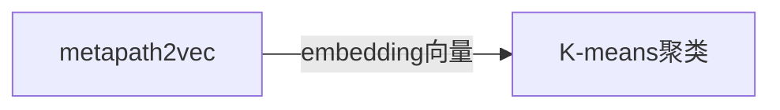
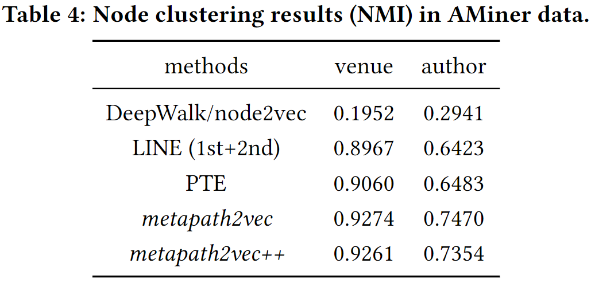
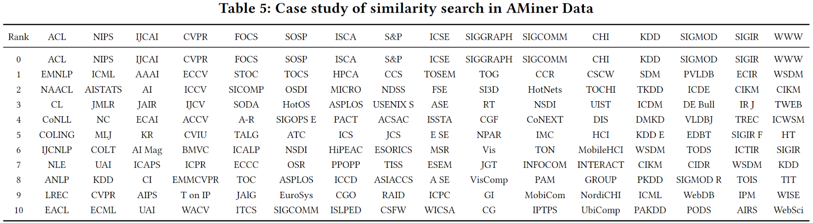
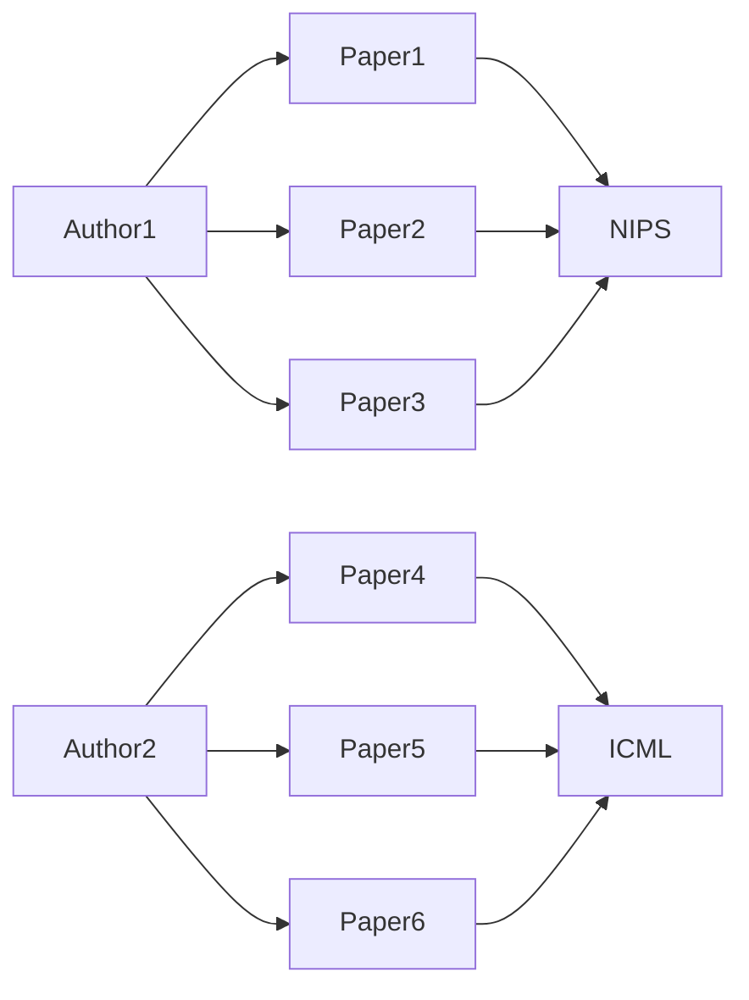

> **人人看得懂的顶会论文系列之**：metapath2vec  
> **KDD**(ACM SIGKDD Conference on Knowledge Discovery and Data Mining) 2017，引用2.4K  
> **论文标题**：metapath2vec: Scalable Representation Learning for
Heterogeneous Networks  
> **Author**: Microsoft Research(微软研究院) Yuxiao Dong

# 1.前置知识
## 1.1Word2Vec
**Random Walk**：
- 随机选择一个单词作为起始节点。
- 根据一定的概率分布选择下一个单词，这个概率分布可以是基于共现频率的。
- 重复这个过程，生成一个单词序列。

**Embedding阶段**
学习每个词的低维向量表示，这些向量能够捕获词的语义信息。  
包含Skip-Gram和CBOW两种模式：
Skip-Gram：给定word，预测上下文

CBOW：给定上下文，预测word

## 1.2同构图挖掘研究
word2vec属于NLP领域的算法，受word2vec启发的**同构网络**表示学习框架还有DeepWalk、LINE和node2vec等。

DeepWalk和node2vec都是基于随机游走（random walk）的图嵌入（graph embedding）方法，它们都旨在学习图或网络中节点的低维向量表示。区别如下：

|算法|随机游走策略|注意力|年份|
|--|--|--|--|
|DeepWalk|简单随机游走|局部|2014|
|node2vec|深度优先搜索（DFS）+  广度优先搜索（BFS）|局部|2016|
|LINE||局部+全局|2015|

[DeepWalk: Online Learning of Social Representations](https://arxiv.org/abs/1403.6652 '2014年')  
[node2vec: Scalable Feature Learning for Networks](https://arxiv.org/abs/1607.00653 '2016年')  
[LINE：Large-scale Information Network Embedding](https://arxiv.org/pdf/1503.03578.pdf '2015年微软')  

**深度优先搜索（DFS）**：在随机游走过程中，如果当前节点有未访问的邻居，则倾向于选择一个未访问的邻居作为下一个节点。  
**广度优先搜索（BFS）**：在随机游走过程中，如果当前节点有未访问的邻居，则倾向于选择一个已访问的邻居作为下一个节点。

## 1.3异构图挖掘研究
阿里巴巴研究人员于2018年在论文“ Billion-scale Commodity Embedding for E-commerce Recommendation in Alibaba”中提出了EGES（ Enhanced Graph Embedding with Side information）模型。它将物品属性信息（side information）融入到基于DeepWalk的图模型中。

# 二、适用场景
论文提出了针对**多种类型节点和链接**的异构网络的embedding方法。

## 2.1算法基本思路
metapath2vec：使用meta-path based random walks（随机游走）生成节点的异构邻域信息（使用节点的邻域信息表达节点），然后利用skip-gram生成节点的embedding信息。  
其中meta不是指facebook，而是指metapath元路径。

# 三、算法效果
对128维的embedding进行PCA降到2维进行可视化，两个版本metapath2vec、metapath2vec++效果都遥遥领先。

## 3.1测试数据集
- AMiner Computer Science (CS) dataset 
- the Database and Information Systems (DBIS) dataset

## 3.2metapath选择
有两种metapath被认为具有业务意义，且效果较好：
- APA（Author-Paper-Author）
捕捉共同作者（coauthor semantic）
- APVPA（Author-Paper-Venue-Paper-Author）
捕捉作者在同一个会议发表论文  

这里选择APVPA进行测试。

## 3.3应用效果：多分类任务
样本拆分为训练集和验证集，图中的5%代表：选择5%样本进行训练，对剩下的进行预测。可以看到：
- 少量样本的时候，metapath2vec算法相比最前沿的算法增益13-15%，表现优秀。
- 完全训练的时候，算法也相比最前沿的算法增益2-3%

作者认为主要是因为充分考虑了：**节点的不同类型**以及**metapath加持**。

### 调参指南-参数不敏感
算法过程用到了skip-gram-based representation，作者实验证明了，针对**Multi-Class Classification（多分类任务）**，w、l、d、k等几个参数对算法基本metahpath2vec算法基本没有太大影响。
> 言外之意：别瞎调参了~  

## 3.4应用效果：用于无监督聚类

使用信息论中的normalized mutual information (NMI 归一化互信息)来评估聚类结果，其值域在[0,1]之间，其中0表示两个聚类结果完全不相关，1表示两个聚类结果完全一致。

venue预测相比最先进算法提升2–3%
author预测相比最先进算法提升13–16%

### 调参指南

推荐参数：w = 800∼1000， l = 100，d = 128 ， k = 7。
不过很多实现没有这么多参数可以调，比较有指导意义的应该就是输出128维。

## 3.5应用效果：相似检索
利用 cosine similarity，计算节点相似度。
比如ACL（Association for Computational Linguistics 计算语言学协会）会议，算法计算相似节点都是NLP领域的会议，较为精准。
Top5相似会议为：
- EMNLP (1st)
- NAACL (2nd)
- Computational Linguistics(3rd)
- CoNLL (4th)
- COLING (5th)

# 四、论文创新的点
## 4.1meta-path based random walks
meta-path based random walks（基于元路径的随机游走）: 是一种考虑了异构图中节点类型的游走算法。
可以避免传统随机游走的倾向：
- 频繁访问**高度可见的节点类型**（Highly Visible Types of Nodes）  
这些节点类型在网络中占据了主导地位，即它们在随机游走生成的路径中出现的频率很高。这意味着，随机游走者在网络中游走时，更倾向于访问这些类型的节点，因为它们在网络中更为常见。
- 频繁访问**集中的节点**（Concentrated Nodes）  
这些节点接收了大量的路径指向它们，也就是说，大量的随机游走路径都指向这些节点。

元路径保证了不同类型的节点可以合适的传递到skip-gram模型进行训练。
比如在上图（Figure 2(a)）中，定义meta paths='OAPVPAO',对于Author节点a4，游走算法会倾向于访问Paper节点p2和p3。

## 4.2不依赖强关联
相比传统方法，比如PathSim，不依赖强关联。
比如Author1和Author2从未在相同的会议上发表文章，传统方法计算相似度为0，但是网络表示学习类算法，可能计算Author1和Author2具有很高的相似度。  
*备注：这个特性非metapath2vec独有，这一类算法其实都有这个特习惯*

# 五、算法特性
## 5.1算法运行效率
作者用40个2.3 GHz的CPU核心进行训练，运行metapath2vec++算法，处理900万authors，300万papers，3800会议的全量AMiner CS network，耗时9分钟。
CPU核心数与加速的关系如下图：

基本可以认为CPU核数与速度是线性关系，因此大家可以线性推算在自己数据集和电脑上的计算时间。  
推算100万节点大小的图，单机4核CPU，跑算法时间也是9分钟左右，满足大部分单机研究的需要。

## 5.2基础版与升级版区别
metapath2vec算法与metapath2vec++区别：负采样(negative sampling)过程，升级版充分考虑了节点的类型信息。  
**正样本**（Positive Samples）： 在skip-gram模型中，正样本是指中心节点（即我们要学习的节点）和它的一个邻接节点。例如，如果我们有一个句子“the quick brown fox jumps over the lazy dog”，如果我们选择“quick”作为中心节点，那么与“quick”一起出现的“brown”就是一个正样本。  

**负样本**（Negative Samples）： 负样本是指在训练过程中除了正样本之外的其他随机选择的节点。这些负样本的目的是为了帮助神经网络区分哪些节点是与中心节点真正相关的（即正样本），哪些是与中心节点不相关的（即负样本）。

两种效果其实差不太多，不用太在意这个细节。

# 附件
- [\[Paper\]](https://ericdongyx.github.io/papers/KDD17-dong-chawla-swami-metapath2vec.pdf '')
> 作者的原始算法是C++实现，和数据一起打包了大约7个G的资料。
> 以下是Python实现的版本，推荐DGL，有docker环境安装非常方便
- [\[PythonCode-stellargraph库\]](https://github.com/stellargraph/stellargraph/tree/9370caed1137c2527523a39212072df1760ca00f '')
- [\[PythonCode-DGL库\]](https://github.com/dmlc/dgl '')

进一步深入理解材料：
https://zhuanlan.zhihu.com/p/142316634
