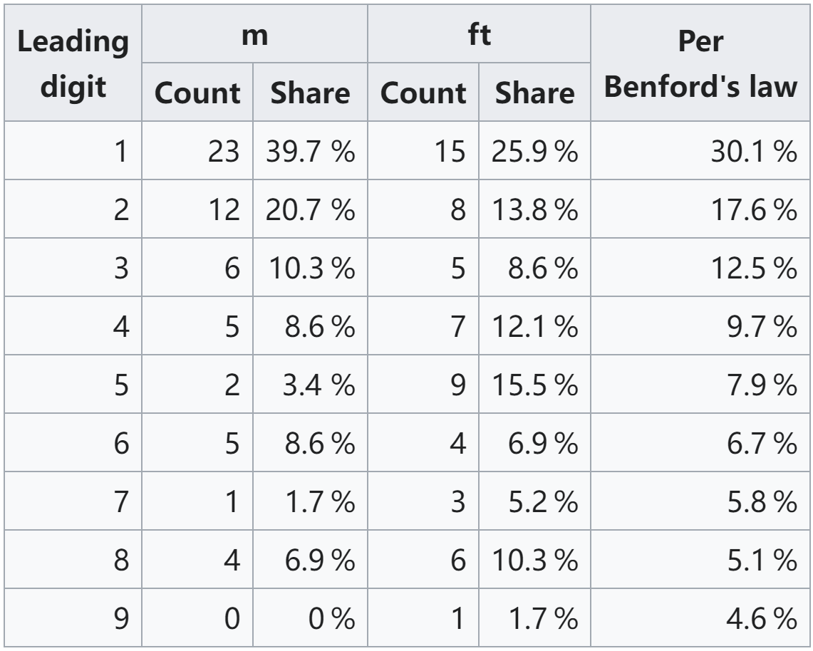
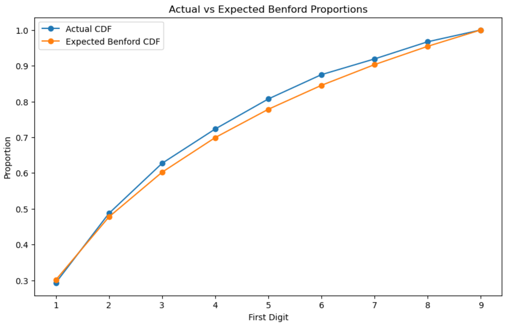

# 1. 定义
1938 年，弗兰克·本福德 (Frank Benford)在文章"The Law of Anomalous Numbers"中，提出了**本福特定律**(Benford’s Law),并且在20 多个不同领域的数据集上验证了这一定律。
自然界中的许多数据集，其首位非零数字（1 到 9）的分布并不是均匀的，而是较小的数字出现频率更高。这种分布遵循对数分布，被称为本福特定律、班佛定律、数字法则（Significant Digit Law）。
概率公式如下：
$$
P_{\text{Ben}}(d) = \log_{10}\left(1 + \frac{1}{d}\right), \quad d = 1, 2, \ldots, 9
$$
其中,$d$ 是首位数字，范围从 1 到 9。
扩展查表概率如下：
| 数字 | 首位数字概率 | 第二位数字概率 | 第三位数字概率 |
| ---- | ---------- | ------------- | ------------- |
| 0    | -         | 11.97%        | 10.18%|
| 1    | 30.10%     | 11.39%        | 10.14%|
| 2    | 17.61%     | 10.88%        | 10.10%|
| 3    | 12.49%     | 10.43%        | 10.06%|
| 4    | 9.69%      | 10.03%        | 10.02%|
| 5    | 7.92%      | 9.67%         | 9.98%|
| 6    | 6.69%      | 9.34%         | 9.94%|
| 7    | 5.80%      | 9.04%         | 9.90%|
| 8    | 5.12%      | 8.76%         | 9.86%|
| 9    | 4.58%      | 8.50%         | 9.83%|

湖泊面积、河流长度、报纸上的阿拉伯数字、物理常数、股票市场指数、个人电脑上的文件大小、生存分布、强子宽度、脉冲星的各种量等符合本福特定律。

# 2. 适用范围
## 2.1 **已知情况**
- **量级跨度越大**的数据，越是符合本福特定律。年龄、身高、体重、智商等存在**上下限**的数据不符合此定律。
- 适用于**自然产生**的数据，不能有人为操纵。人为截断或限定范围的情况，比如Top50城市的人口、电话号码、身份证号等不适用。 **人工修改过的数据**、彩票上的随机数据，也不符合本福特定律。

## 2.2 **预期遵从的情况**
- 平均值大于中位数且偏度为正的分布
- 由数字的数学组合得出的数字：例如数量×价格=支付金额
- 交易级别数据：例如支出、销售额

## 2.3 案例：世界最高的58座建筑
[58 tallest structures in the world by category](https://en.wikipedia.org/wiki/List_of_tallest_buildings_and_structures#Tallest_structure_by_category '')


# 3. 应用
本福特定律已经被用于税务和会计中的欺诈检测,比如:
- 选举造假
2003 年加州州长选举、2009年伊朗总统选举、2000 年和2004年美国总统选举、2009 年德国联邦选举。
- 财务欺诈
2001年度到2002年度，安然公司所公布的每股盈利数字不符合“本福特定律”；
2014-2015国内金亚科技财报数据不符合本福特定律，同期股价上涨400%，16年公司承认造假。
茅台、格力等优质公司的财报符合本福特定律。

## 3.1 KS值
Kolmogorov-Smirnov 检验是一种非参数统计检验方法，用于比较两个分布之间的差异。可以用于判断：数据集是否符合是否符合本福特定律。
KS统计量是样本的经验分布与理论分布之间**最大绝对差值**，计算公式为：
$$ D = \max | F_{\text{obs}}(d) - F_{\text{theory}}(d) | $$
其中，$F_{\text{obs}}(d)$ 是样本的累积分布函数，$F_{\text{theory}}(d)$ 是理论累积分布函数（根据本福特定律计算）。

# 3.2 代码：本福特定律+KS值，检测潜在数据造假和异常
```python
# 准备数据
import pandas as pd
import numpy as np
import matplotlib.pyplot as plt
from scipy.stats import kstest
from scipy.stats import ks_2samp
import seaborn as sns

# Step 1: Generate a dataset that may follow Benford's Law
# This dataset contains first digits of real-world financial transaction amounts
benford_proportions = np.log10(1 + 1/np.arange(1, 10))
data = np.random.choice(np.arange(1, 10), size=1000, p=benford_proportions/benford_proportions.sum())
data = pd.DataFrame(data, columns=['First_Digit'])

# Step 2: Calculate and plot actual vs expected probabilities
counted = data['First_Digit'].value_counts().sort_index()
actual_probs = counted / counted.sum()
expected_probs = pd.Series(benford_proportions, index=np.arange(1, 10))
# 计算 累积分布函数（CDF）
expected_cdf = np.cumsum(expected_probs)
actual_cdf = np.cumsum(actual_probs)
# 数据分布可视化
fig, ax = plt.subplots(figsize=(10, 6))
ax.plot(np.arange(1, 10)-1, actual_cdf, label='Actual CDF', marker='o')
ax.plot(np.arange(1, 10)-1, expected_cdf, label='Expected Benford CDF', marker='o')
plt.xlabel('First Digit')
plt.ylabel('Proportion')
plt.title('Actual vs Expected Benford Proportions')
plt.xticks(ticks=np.arange(9), labels=np.arange(1, 10))  # 设置x轴的刻度标签为1到9
plt.legend()
plt.show()
```


```python
# 手工计算KS值
ks_statistic = np.max(np.abs(expected_cdf - actual_cdf))
print("Calculated KS Statistic:", ks_statistic)
```
> Calculated KS Statistic: 0.029901959985743187

```python
# 模拟分布，适用算法计算KS值
from scipy.stats import ks_2samp

# 按概率生成分布，计算KS值
actual_samples = np.repeat(np.arange(1, 10), (actual_probs * 1000).astype(int))
expected_samples = np.repeat(np.arange(1, 10), (expected_probs * 1000).astype(int))

statistic, p_value = ks_2samp(actual_samples, expected_samples)

print("KS Statistic from ks_2samp:", statistic)
print("P-value from ks_2samp:", p_value)
```
> KS Statistic from ks_2samp: 0.028768844221105528
P-value from ks_2samp: 0.7868462306121781
```python
from scipy import stats
# 计算效果大小（Cohen's d），这个值表示两个分布之间的标准化差异。
# 0.2以下：差异非常小，0.2到0.5：差异小，0.5到0.8：中等差异，超过0.8：差异较大
def cohen_d(x, y):
    nx = len(x)
    ny = len(y)
    dof = nx + ny - 2
    return (np.mean(x) - np.mean(y)) / np.sqrt(((nx - 1) * np.var(x) + (ny - 1) * np.var(y)) / dof)

effect_size = cohen_d(actual_samples, expected_samples)
print("Effect Size (Cohen's d):", effect_size)

# 计算置信区间
# 结果中置信区间很窄且接近0，表明两个分布之间的差异非常小
confidence_interval = stats.norm.interval(0.95, loc=effect_size, scale=1/np.sqrt(len(actual_samples)))
print("95% Confidence Interval for Effect Size:", confidence_interval)
```
> Effect Size (Cohen's d): -0.053141000966090084
95% Confidence Interval for Effect Size: (-0.11512050419654624, 0.008838502264366069)


# 参考文档
[The significant digit law in statistical physics](https://arxiv.org/pdf/1005.0660 '')

[python分析應用 — Benford’s Law 班佛定律](https://medium.com/@frankkcc/python%E5%88%86%E6%9E%90%E6%87%89%E7%94%A8-benfords-law-%E7%8F%AD%E4%BD%9B%E5%AE%9A%E5%BE%8B-15431d2a5312 '')


[本福特定律，识别财务舞弊和数据造假！](https://www.itshenji.com/database/show?id=76 '')


[使用本福德定律甄別數據造假(Benford's Law)](https://bigdatafinance.tw/index.php/tech/341-benford-s-law '')


[KS检验及其在机器学习中的应用](https://www.heywhale.com/mw/project/5ea3f05f105d91002d502ed2 '')

Prompt：
你能给我举个本福特定律检测数据集造假的案例嘛？
我希望你用Python实现，代码可以直接运行，也就是说用可以直接拉取的数据集。
我希望的代码步骤如下：
1. 读取数据到dataframe结构中。
2. 根据本福特定律计算期望概率值，并且与实际概率值在图中直观的进行对比
3. 使用KS或者你认为核实的假设检验方法，计算分布的差异情况，并且给出结论。