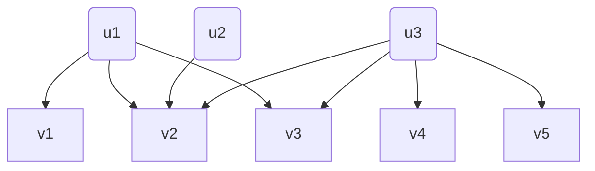

# 业务场景中的二部图结构
二部图（英语：Bipartite **[bai'pɑ:tait]** graph ），又称为二分图、偶图、双分图。直观看就是以下这样的特殊图结构：

u1 & u2 & u3 属于**集合U**，v1 & v2 & v3 & v4 & v5 属于**集合V**，U和V**互斥**。边的集合为**E**，其中所有的边**连接集合U中的一个点和集合V中的一个点**。   
在社交场景，用户给文章虚假点赞、用户虚假关注；广告场景，用户在App上进行异常点击和下载，都可以将用户行为抽象为二部图的异常检测问题进行分析挖掘。

# 针对二部图的无监督异常检测算法
- [x]  [**FRAUDAR: Bounding Graph Fraud in the Face of Camouflage**]
- 论文情况：2016年论文，361引用
- 论文介绍：采用Dense-block，对二部图，进行无监督异常检测
- 论文解读：[从虚假点赞到恶意评论：FRAUDAR算法如何一路斩妖除魔？](https://zhuanlan.zhihu.com/p/687094360)  

- [ ]  **Spotting Suspicious Link Behavior with fBox: An Adversarial Perspective** 
- 论文情况：*2014年*，引用128
- 论文介绍：采用SVD（Singular value decomposition 奇异值分解），对二部图，进行无监督异常检测
- 论文解读：

- [ ] **GANG: Detecting Fraudulent Users in Online Social Networks via Guilt-by-Association on Directed Graphs** 
- 论文情况：*2017*，引用98
- 论文介绍：采用MRF（Markov Random Field 马尔科夫随机场），对二部图，进行无监督异常检测
- 论文解读：

