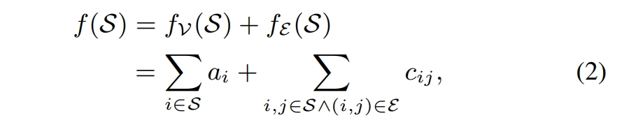

> 人人看得懂的顶会论文系列之：FRAUDAR - KDD 2016 最佳论文  
> 论文标题：FRAUDAR: Bounding Graph Fraud in the Face of Camouflage    

# 一、适用场景
社交虚假关注、虚假点赞、虚假粉丝，电商虚假评论，App刷榜、广告刷量等各类满足二部图关系的刷量场景。  

# 二、算法效果
作者对比SpokeEN算法，在无伪装的欺诈注入（None）、随机伪装的欺诈注入（Random）、偏向伪装的欺诈注入（Biased）、劫持账户的欺诈注册（Hijacked）四种伪装(Camouflage)手法下，都**遥遥领先**。

1. 针对包含2000个用户和2000个产品，欺诈块包含200个欺诈用户和200个欺诈产品的Amazon评论图上进行测试，结论**赢麻了**。
2. 针对在4170万用户和14.7亿条边的Twitter关注者-被关注者图上进行测试，检测到一个包含4031个关注者和4313个关注者的异常块，抽样发现异常块中，推文异常或者账号被标记异常的比例明显高于对照组，结论**相比随机抽样，有明显恶意浓度提升**。

# 三、论文创新的点
1. 坏人会通过关注或者评论正常账户来伪装恶意行为，论文称呼这种行为为**伪装（Camouflage）**。相比传统方法，Fraudar算法可以很好的识别类似的伪装的恶意行为。 
**解读：原因是作者构造的全局优化目标g(S)，满足边可疑度定理：在子集中添加边会增加该子集的可疑度。证明在作者的附录A。**

2. 时间复杂度与边数接近线性关系
解读：**我算的快**

3. 代码公开
解读：**我能复现，不是那些吹牛的妖艳贱货**

4. 从理论上证明了，算法找到的解决方案至少是最优解决方案的一半以上。

# 四、算法的优化目标
简单说，就是找到二部图中的密度子图，通常这些稠密子图就是恶意团伙。  
优化指标为密度指标 **g(S) = f(S) / |S|  **
其中，f(S)是二部图总可疑度，全局总可疑度是节点可疑度和边可疑度的总和，即  f(S) =节点可疑度+边可疑度 = 

可疑度的公式：1/ log(x + c)，其中c是一个小常数（在实验中设置为5），以防止分母为零，可以看到边很多的节点可疑度较低，业务上主流App用户很多，可疑度较低也比较合理。
下面是 1/ log(x + 5)的函数图像：

作者证明g(S)可以同时满足的四大公理：  
**节点可疑度公理**：如果一个子集中的节点可疑度更高，那么这个子集整体可疑度也更高。  
**边可疑度公理**：在子集中添加边会增加该子集的可疑度。  
**大小公理**：在边密度相同的情况下，更大的子集比小的子集更可疑。  
**集中度公理**：具有相同总可疑度的子集中，较小规模的子集比大规模的子集更可疑。  
证明在作者的附录A。

# 五、算法迭代过程
总体思路是采用贪心策略，寻找最优化Density Metric g的子图。
U:用户集合、W:对象集合，贪心搜索的步骤如下：  
- **初始化**：设置当前优化集合X为U ∪ W，即所有用户和对象的集合。  
- **计算变化量**：对于集合X中的每个节点i，计算移除i后f值的变化量 ∆i = f(X \{i})−f(X)。这个变化量表示移除节点i对总可疑度f的影响。
- **选择下一个移除节点**：在每个步骤中，选择使得∆i最大的节点i，即选择让可疑度f上升最快的节点i，然后将节点i从集合X中移除。移除后得到新的集合X(i).  
- **更新集合**：移除节点i后，重新计算所有与i相邻的节点j的∆j值。因为除了与节点i相邻的节点外，其他节点的∆j值不会因为移除i而改变。  
- **迭代**：重复上述过程，每次都选择一个节点移除，直到集合X的大小缩减到0。  
- **返回结果**：在最后，回溯所有得到的集合X(i),返回最大化密度指标g的X(i)。  

每次迭代，只用更新与待删除节点i相邻的节点j，更新后边立马被删除，因此复杂度为O(|E|),|E|为边的个数。每次更新作者实用特殊构建的优先树（Priority Tree），可以让操作的复杂度优化至log(|V|)，|V|是节点数。因此，最终算法的复杂度是O(|E|× log |V|)，作者描述是near-linear time。

## 关于优先树（Priority Tree）
相关的概念属于开发领域、数据结构课程的内容，只讲几个对理解算法有帮助的概念。  
1. 对数据一般会有增、删、查、改几个动作，Fraudar算法涉及到删除元素和查询最大值动作。正常情况下，复杂度是O(N),也就是暴力每一个都检查一遍是不是要删除的元素或者要查询的元素。  
2. 数据结构这门课程，就是研究数据怎样存储，可以让你删除元素或者查询元素的时候非常快。其中就介绍了很多树形结构，基本思路就是先给数据排序，类似打牌的时候把牌按一定的顺序排好，这样找牌、出牌就比较快。

# 六、算法在风控场景的应用
FRAUDAR算法计算非常快，效果上看能挖掘到明显异常的稠密子图，但是由于二部图本身结构简单，蕴含的信息有限，因此比较适合针对整个大盘、大批量数据集上的"初筛"。  
找到稠密的子图结构后，可以继续使用Louvain算法（aka.Fast unfolding算法）等进行进一步的分析与确认。

# 后续论文解读计划
Louvain算法 - 4月  
CatchSync算法 -4月  
SynchroTrap算法 - 4月  

# 参考文献
[Fraudar论文](https://bhooi.github.io/papers/fraudar_kdd16.pdf 'KDD Best Paper')  
[Fraudar代码](https://github.com/safe-graph 'safe-graph')  
[应用-Fraudar算法在京东关系网络反欺诈中的应用](https://www.secrss.com/articles/24864 'JD')  
[应用-复杂网络算法在平台业务安全中的应用](https://cloud.tencent.com/developer/article/1509696 '美丽联合集团（蘑菇街）')  
[Fraudar入门科普好文-为什么图计算能正面硬刚黑色产业薅羊毛？](https://m.thepaper.cn/newsDetail_forward_19128379 'Fraudar入门科普好文')  
[Fraudar作者的博客](https://bhooi.github.io/ '')
[为什么图计算能正面硬刚黑色产业薅羊毛？](https://m.thepaper.cn/newsDetail_forward_19128379 '谭婧小姐姐')  

> 24年会持续更新20篇**风控策略**、**风控模型**、**黑灰产**相关文章。  
> 文章源自日常**风控策略对抗工作**中的学习与思考总结，希望对大家打击黑产有所帮助。  
> 如果你对风控感兴趣或者是业内人士，可以关注我或者留言讨论。