# 前置知识
## 广告场景怎样识别用户
IDFA iOS设备采集
GAID Android设备采集
IMEI 15位，安卓OS
AndroidID
设备指纹(User Agent等字段混合)

# 广告产业链
整个**在线广告产业链**是非常复杂和成熟的产业，本质是广告主**出钱买流量**，目的可能是发展付费用户、激活老用户、流失用户召回等。
简单版的产业链图如下：
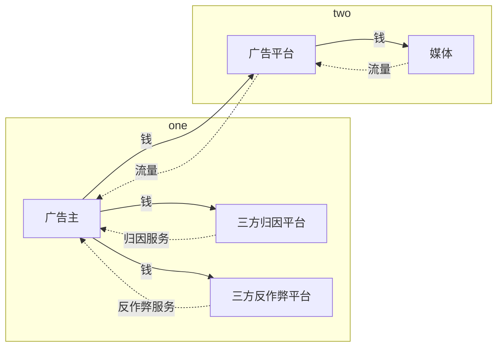
很多恶意媒体把广告主当成待宰的羔羊，广告平台可能对打击作弊也不是很上心或者能力不足，导致了广告主对平台和媒体的不信任。因此很多广告主会单独采购独立的第三方服务，用以优化预算投放。
根据腾讯灯塔《2018年广告反欺诈白皮书》，黑产流量占比在 **15%** 左右。
根据主要服务出海业务的，商汇量科技Mobvista《移动广告反作弊白皮书2.0》，黑产流量占比在 **11%** 左右。

某刷量平台报价：
PV 10000个0.3元(其中随机携带点击，真TM专业)，实现App下载成本在刷下载：0.2~0.8元
刷激活：0.3~1元
激活+留存：1~1.5元

常见的第三方检测/归因平台如下：
- 以色列AppsFlyer
- 德国Adjust
- 国内TalkingData
- 美国Kochava、TUNE

三方反作弊平台：
常见的有英国的Machine、印度的mFilterIt、
美国的FraudScore和DataVisor等。

完整版数字广告产业链图如下：
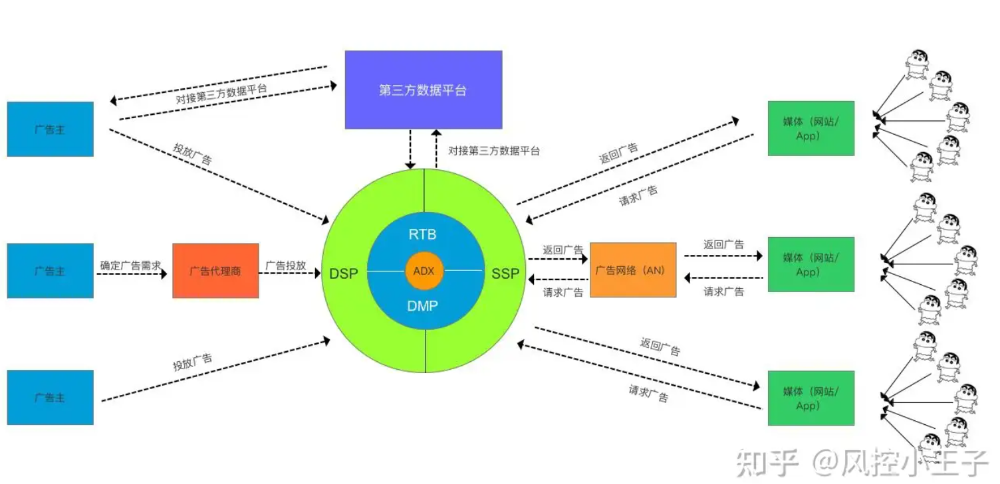

# 广告反作弊的术语
广告行业入门的难点之一就是琳琅满目的专有名词，常用的一些综总结如下。
## 计价方式
|计费方式|解释|备注|
|--|--|--|
|CPM(Cost Per Mille)|按千次曝光收费|曝光不值钱，所以单位不是一次曝光，而是千次。|
|CPC(Cost Per Click)|按点击次数收费|主流计费方式，点击代表用户有兴趣，可能是目标群体|
|CPA(Cost Per Action)|效果行为付费|按效果付费，比如下载CPD(Cost Per Download)、安装CPI(Cost Per Install)、产生流水CPS(Cost Per Sales)等||
|CPT(Cost Per Time)|按时间段收费|比如公交站的iPhone广告|

# eCPM

# 作弊方式
## 归因作弊
归因就是分析，用户的转化是前面的什么行为导致的，影响媒体的收益结算。归因主要回答下面的问题：
1. 用户属于是自然流量，还是广告吸引来的转化 ？ 
2. 如果是广告导致的转化，哪个媒体在什么时间段的曝光起了主要作用？
常见的归因策略包括×××

分析归因机制，很容易想到，发送虚假曝光和点击请求，可以导致错误归因，把自然流量或者其它广告平台的流量计算到自己的媒体上。
比如以下作弊场景：
- 在手机上安装监听程序，只要有App安装就给平台发消息，声称是自己给用户展示了广告或者用户在自己广告位上点击了广告。如果平台采用最近一次展示归因，则收益被恶意媒体获得。  （**存疑，似是而非**）
- 篡改或重复使用窃取获得的 cookie 信息或移动装置标识的流量。 
- 被劫持的设备以及群控设备产生的流量。 

# 刷量作弊
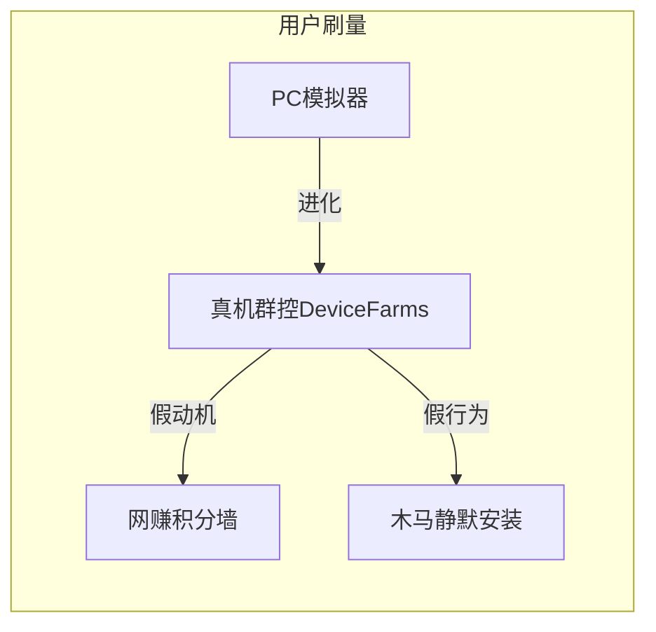
作弊流量特征
- 高频请求、重复请求、周期性请求
打掉高频请求保护系统，过滤掉明显自动机的重复请求、周期性请求是风控系统的基本功能。这类请求一般也伴随着CVR（转化率）的异常，比如**大量点击**但是不会浪费时间去**下载**和**安装激活**。
- 数据中心、作弊代理服务器产生的流量。 
比如在公有云、IDC服务器上部署自动机脚本，产生的大量、周期性请求。 
- 机器人或爬虫的流量
- 无头浏览器(headless browser)等非正常浏览器的流量。
- 无效请求
必填信息缺失、校验字段不通过、时间戳太久远等。
- 高危设备、高危 IP、高危App、高危网站的流量。
- 虚拟化设备中产生的流量。 
- 被劫持的广告代码产生的流量。 
- 以金钱补偿为动机的操纵测量数据行为。 
- 操纵或伪造用户位置数据以及相关属性的流量。 
- 无效代理流量（即来自中间代理设备的无效流量，包括通过代理设备操纵流量计数、创建/传输非人类流量或无法通过协议验证的流量）。
下面是灰产给的网赚积分墙小技巧：
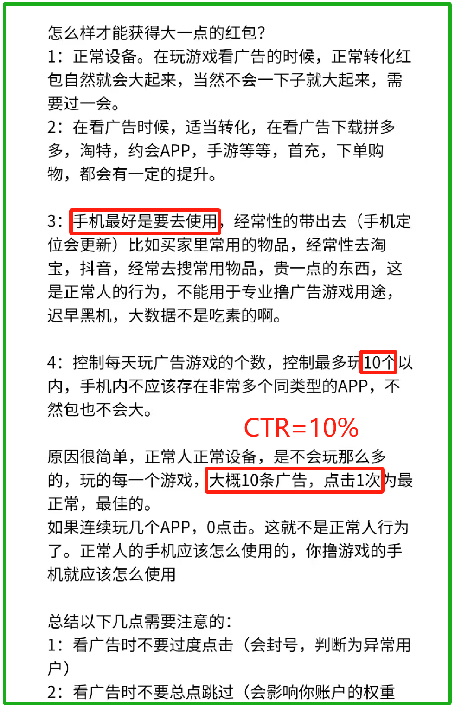
不得不感慨，抓耳挠腮想策略，不如直接看灰产给写的策略指南。

## 展示作弊
- 通过隐藏/堆叠/覆盖或其它方式导致用户无机会看到正常广告内容的流量。 

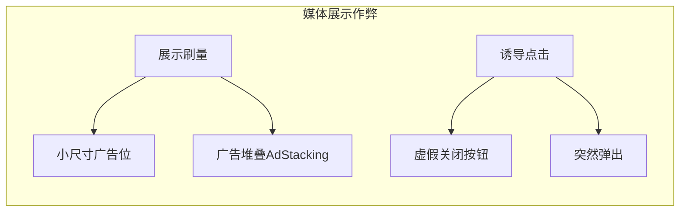
广告堆叠AdStacking：一个可见广告和多个隐藏广告堆叠展示，用户点击的话，CPC也会多次付费。恶意特征是，用户会短时间内发起多次点击请求。

## 素材违规
在黄色网站、赌博网站

主要的作弊方式如下
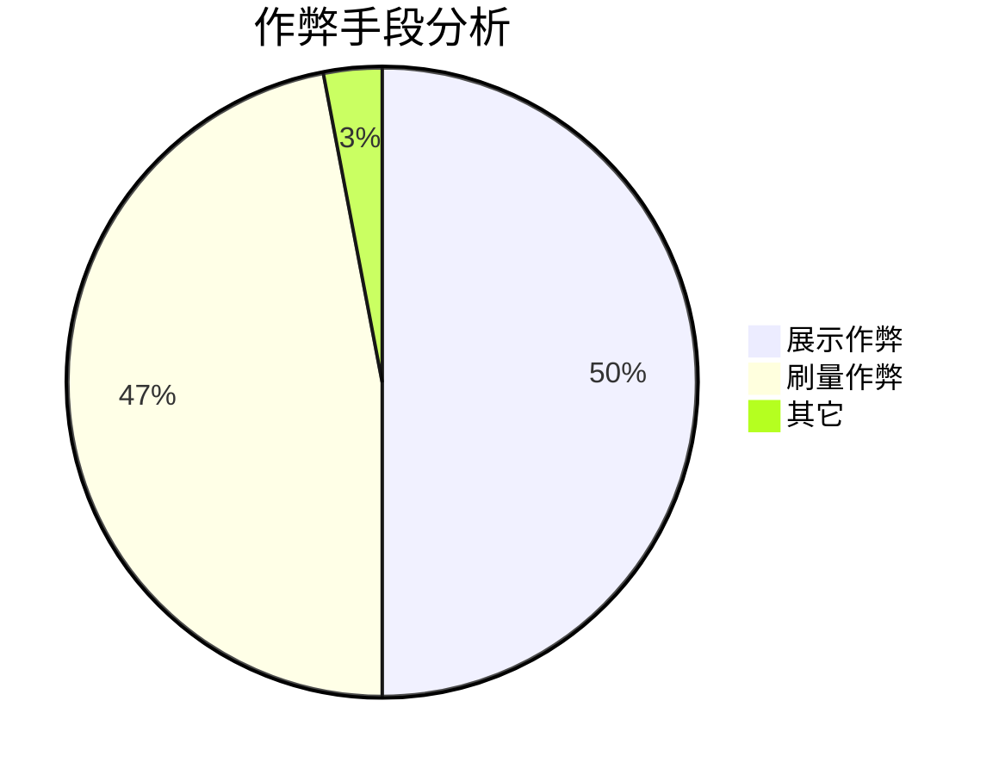

# 策略体系
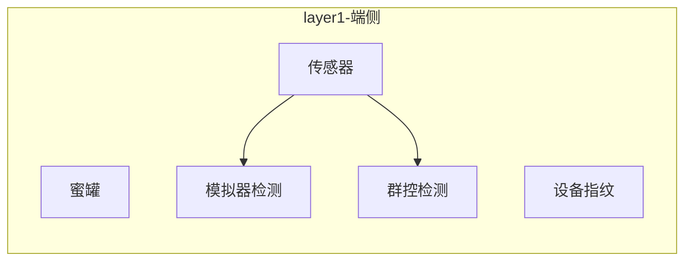
传统方式，前端只负责数据采集，后端负责数据分析和结果判断。由于广告行业对于用户数据的采集越来约严格，前端直接判断后，传递判断结果到云测慢慢成为了主流。
- 群控检测：机架上的设备会出现陀螺仪等**传感器不变化**类似的特征。

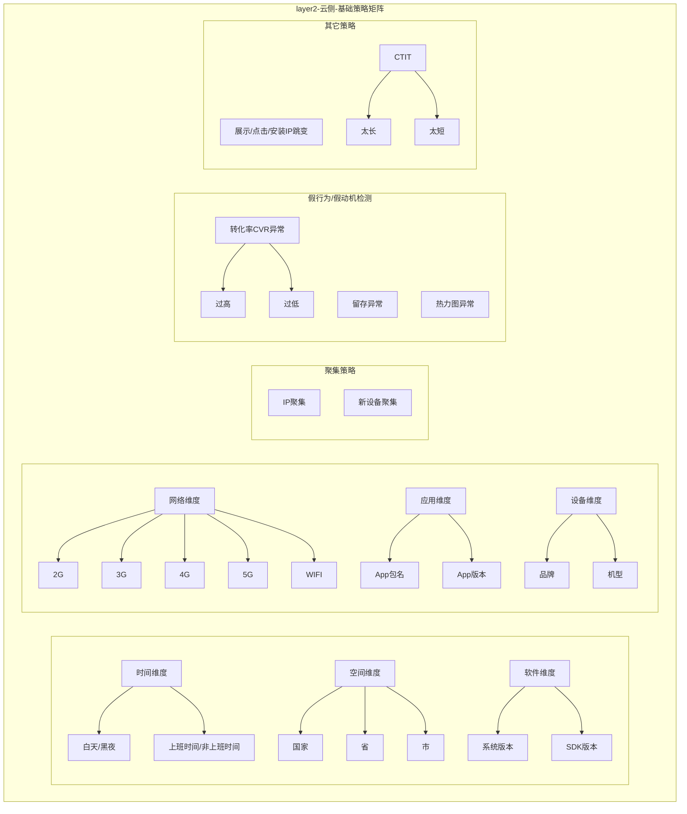

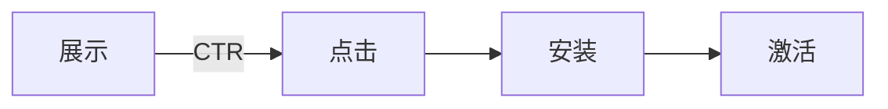
CTR一般5%左右，**按互联网上的资料**，超过10%或者低于2%都会被策略人员重点关注。

CTIT:**点击**到安装后**激活**的时间，考虑到App的下载和安装，耗时应该在几秒到几十秒之间。比如1s点击到安装激活，可能就涉及归因作弊。
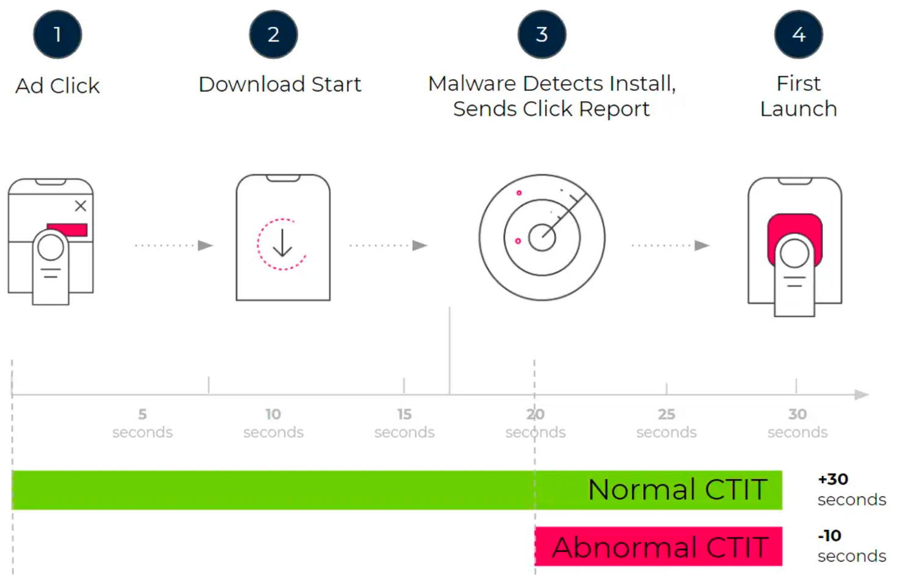

正常的CTIT分布是下图中的灰色部分，橙色部分是异常的短时CTIT。
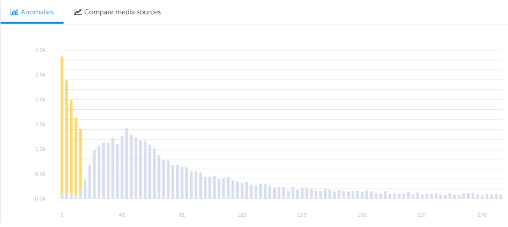

## 设备指纹
只要累积足够的数据，风控策略对用户的判断会越来越准确，因此很多黑产想到了分散匿名化，伪装成新用户，比如通过如下三清+重置广告ID的方法，基本很难把分散的用户行为关联起来，聚集策略自然也就失效了。
- 系统三清
	- 清空Data分区==>安装的App没了，但App的数据还在，重新安装App能找回来数据
	- 清空Cache分区==>清一清系统缓存
	- 清空Dalvik Cache分区==>系统首次启动变慢
	- 保留**System系统**分区和内存/SDK卡中的数据==>App产生的用户数据都在、拍的照片都在
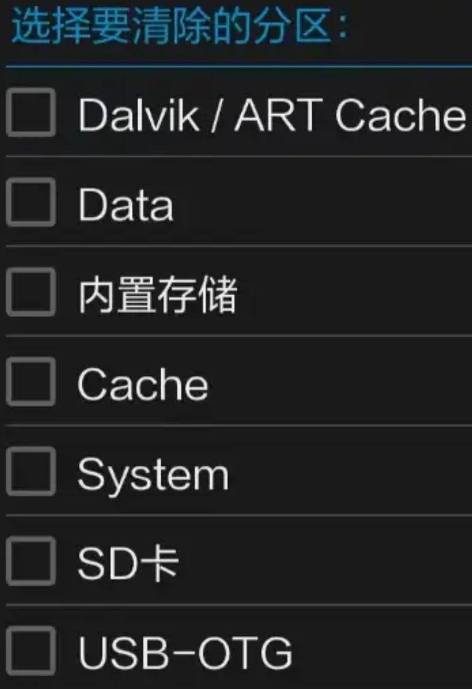
- 重置广告标识符
潜在识别的恶意特征是**新用户占比过高**。

## 作息曲线模拟

# 核心指标
## 转化
## 留存

# 参考文章

[300 万人从事刷量工作，广告主 100 亿打水漂，深度解密流量造假术](https://www.ifanr.com/1225061 '')

[2018年广告反欺诈白皮书-腾讯灯塔](https://3gimg.qq.com/mig_op/beacon/download/WhitePaper-TencentBeacon-2018.pdf '')
[2017年广告反欺诈白皮书-腾讯灯塔](https://3gimg.qq.com/mig_op/beacon/download/WhitePaper-TencentBeacon-2017.pdf '')

[商联网](https://www.cnsecc.com/bk_17153161.html '')

[广告流量反作弊风控中的模型应用](https://zhuanlan.zhihu.com/p/606766437 '')

[广告反作弊做法](https://zhuanlan.zhihu.com/p/30466282 '')

 
# 参考刷量软件
第一款软件飞速流量专家
缺点，被刷速度有点不尽人意，并不是很快（相对于天河流量王），而且IP数量和PV数量很接近，加上如果你不只申请了一个网站的话，那么本来不多的流量会平均分配的。
优点，网站审核较快，而且负责任，基本上还没有使用该软件刷流量时，杀软提示木马。

 第二款，天河流量王。
缺点，首先就是木马问题，在网站通过审核这方面，做的不好，许多网站在刷的时候带木马，不过只有有一款信任的杀软开着，这些木马或者病毒还有点与网站都能. 拦截（本人亲测），再一缺点就是，IP和PV虽然能刷到很多但是，在软件显示和实际流量是有差别的，实际流量往往比显示的流量少，例如显示已刷8000， 实际被刷4000，差不多是这个样子，该显示为PV数量。

第三个软件，流量精灵
优点，提供的功能很多，很细致，
缺点，刷流量的速度不尽人意。（相对于天和流量王）

 
CPU占用 飞速流量专家/天河流量王>流量精灵
内存占用 飞速流量专家>天河流量王>流量精灵
刷IP数量（同等时间） 天河流量王>飞速流量专家>流量精灵

# 想法
概率模型，计算一条请求转化的概率~

OrderId + Process 到下一轮的概率~

曝光->点击的概率
点击->下载的概率
下载->激活的概率

？？强化学习 ？？