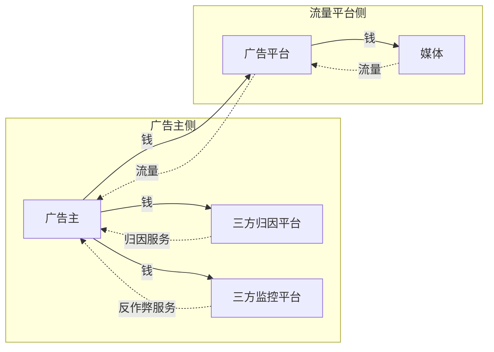
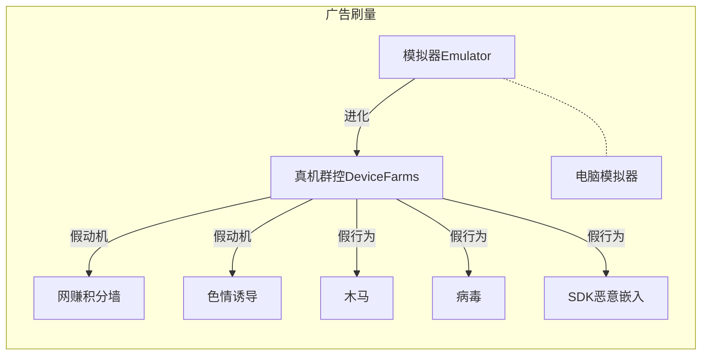
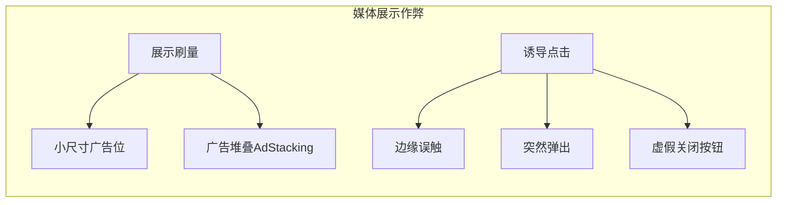

有了数字广告产业以后，每个产品都有了方便触达用户的途径，用心做的好产品更加容易成功。
但是广告投放的过程中，黑产像闻到血腥味的鲨鱼蜂拥而至，伪造点击、诱导点击、刷量、虚假留存严重影响了业务的健康发展。

# 前置知识
## 广告ID
**广告ID**：仅用于广告场景追踪用户，用户可以**随时重新生成**，也可以选择**拒绝广告跟踪**。
**设备ID**：则是各场景通用，可以持续定位到设备，从保护用户隐私的角度，很多大厂都可以放弃采集设备ID。
|类型|简称|全称|平台|
|--|--|--|--|
|广告ID|**IDFA**|Identifier for Advertising|iOS|
|广告ID|**GAID**|Google Advertising ID|Android|
|广告ID|AAID|Android Advertising ID|和GAID是一个东西|
|广告ID|**OAID**|Open Anonymous Device Identifier|国内方案，鸿蒙等用|
|设备ID|IMEI|International Mobile Equipment Identity|Android 10以后非系统级应用无法获取，iOS5+禁掉了，国内厂商看缘分|

# 广告产业链
整个**数字广告产业链**是非常复杂和成熟的产业，重点关注"**钱**"和"**流量**"两条链路的流动。
简化版的产业链图如下：

## 广告归因平台MMP(Mobile Measurement Partner)
通常曝光归因周期是1天，点击归因周期是7天。
|平台|类型|市场|
|--|--|--|
|AppsFlyer|移动端|全球|
|Adjust|移动端|全球|
|Branch||全球|
|TalkingData|移动端|聚焦国内|
|热云数据|移动端|聚焦国内|
|Kochava|||

- AppsFlyer
以色列公司，专户移动端归因平台，号称拥有全球65%的市场份额，相关资料引用量确实也比较多。
- Adjust
德国公司，移动端归因平台，是AppsFlyer的竞争对手，甚至在官网写了一篇帖子力证比AppsFlyer优秀。从格局上看，AppsFlyer行业头部的说法还是靠谱的。
[应用监测：营销行业领军者为何选择 Adjust 而不是 AppsFlyer](https://www.adjust.com/zh/product-comparison/adjust-vs-appsflyer/ '')

很多**恶意媒体**把广告主当成待宰的羔羊，广告平台对于打击作弊**动力不足**或者**能力不足**，导致了广告主对平台和媒体的不信任。因此很多广告主会单独采购独立的第三方服务，用以优化预算投放。

## 恶意流量占比
1. 根据腾讯灯塔《2018年广告反欺诈白皮书》显示，黑产流量占比在 **15%** 左右。
2. 根据主要服务出海业务的商汇量科技Mobvista《移动广告反作弊白皮书2.0》显示，黑产流量占比在 **11%** 左右。
3. 根据占全球份额65%的三方平台AppsFlyer资料推算，接入的黑产流量为**13%** 左右。

## 计价方式
|计费方式|解释|备注|
|--|--|--|
|CPM(Cost Per Mille)|按千次曝光收费|曝光不值钱，所以单位不是一次曝光，而是千次。|
|CPC(Cost Per Click)|按点击次数收费|主流计费方式，点击代表用户有兴趣，可能是目标群体|
|CPA(Cost Per Action)|效果行为付费|按效果付费，比如下载CPD(Cost Per Download)、安装CPI(Cost Per Install)、产生流水CPS(Cost Per Sales)等||
|CPT(Cost Per Time)|按时间段收费|比如公交站的iPhone广告|

# 作弊方式
## 归因作弊
归因分析就是搞清楚用户的转化是什么行为导致的，具体影响媒体的收益结算。
归因主要回答下面两个问题：
1. 用户属于是自然流量，还是被投放的广告吸引来的？
2. 如果是广告的功劳，哪个媒体立了大功，钱给谁？
主流的归因方式是Last-Click，即最后一次点击归因。

分析归因机制，很容易想到，发送虚假曝光和点击请求，可以引导错误归因，把自然流量或者其它广告平台的流量计算到自己的媒体上。
根据AppFlyer的定义，主要有已下两种作弊方式：
1. 点击欺诈(Click Spamming)
也叫Click Stuffing、Click Flood，点击泛滥、点击填塞、**大点击**。指发送海量的曝光、点击归因信息，窃取自然流量或者别的渠道的流量。

2. 点击劫持(Click Injection)
也叫Install Hijacking、点击注入、**小点击**。在手机上安装监听程序，只要有App安装就给归因平台发消息，声称用户点击了自己的广告。如果平台采用Last-Click归因方式，则收益被恶意媒体获得。

## 刷量作弊

模拟器

作弊流量特征:
1. 高频请求、重复请求、周期性请求
2. CVR、留存异常
比如，只点击，但是不下载和激活，CVR异常低。
3. 无效请求
必填信息缺失、校验字段不通过、时间戳太久远等。

下面是灰产给的网赚积分墙小技巧。不得不感慨，抓耳挠腮想策略，不如直接找灰产买份教程：

## 展示作弊
展示作弊一般是媒体主动发起，**小游戏**、**工具类应用**里面非常常见。

# Next
广告反作弊策略对抗 TBD...

# 参考文章
[2017年广告反欺诈白皮书-腾讯灯塔](https://3gimg.qq.com/mig_op/beacon/download/WhitePaper-TencentBeacon-2017.pdf '')
[2018年广告反欺诈白皮书-腾讯灯塔](https://3gimg.qq.com/mig_op/beacon/download/WhitePaper-TencentBeacon-2018.pdf '')
[300 万人从事刷量工作，广告主 100 亿打水漂，深度解密流量造假术](https://www.ifanr.com/1225061 '')
[归因三方监测平台对比分析](https://pre-academy.meetgames.com/article/1000000726 '')

