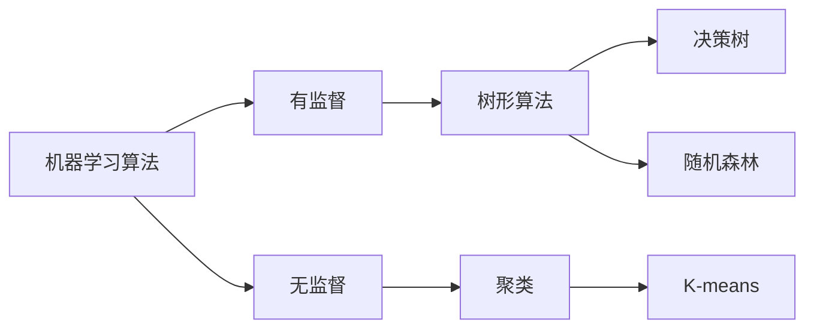
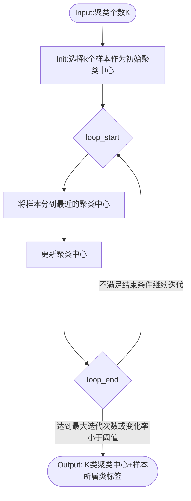

年轻人的第一个机器学习算法一般是**决策树**或者**逻辑回归**，属于有监督算法的范围，通过贪婪搜索寻找局部梯度下降最快的方向进行优化，在满足loss的情况下迭代完成。
在**无监督领域**，还有Clustering算法(聚类算法)，与这两个经典算法**复杂度类似**，具备比较好的解释性，适合**10个维度以下**的特征集分析。其中最经典（*但不一定效果最好*）的就是K-means算法（a.k.a K均值算法）。


# 一个简单的K-means例子
```
print(a)
```


# K-means适用范围
# K-means基本原理




# 聚类结果
K-means会输出训练完成的最终**聚类中心**，以及**样本所属的聚类**。
## 聚类中心
迭代结束以后，一般会第一眼看下聚类中心，基本上是否符合业务预期，训练结果是否可用就心里有数了。


聚类结果的评估一般适用轮廓系数。

# 聚类结果工程化部署
## 方案一 
计算新样本到聚类中心的距离，划分到最近的聚类。

## 方案二
将聚类结果作为决策树的输入，通过决策树输出决策规则，剪枝后部署。

# K-means的改进算法
